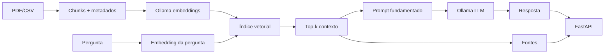

# Arquitetura — Aurora Document RAG

## Objetivo

Responder perguntas usando exclusivamente a documentação da Aurora, com separação explícita entre ingestão, retrieval, geração e API.

## Componentes

| Componente | Responsabilidade |
|---|---|
| `app/documents.py` | lê PDF/CSV e produz chunks rastreáveis |
| `app/embeddings.py` | converte textos em vetores; provider local ou Ollama |
| `app/retrieval.py` | indexa vetores e calcula similaridade cosseno |
| `app/generation.py` | monta prompt e produz resposta; extrativo local ou LLM Ollama |
| `app/rag.py` | aplica top-k, limiar, relevância, geração e fontes |
| `app/main.py` | expõe contratos HTTP; constrói o serviço no `lifespan`; `/health` (liveness), `/ready` (readiness); handler de erros com `error_code` |
| `app/config.py` | `Settings` a partir do ambiente, com validação de faixa e mensagens por variável (falha no boot) |
| `app/errors.py` | exceções tipadas (`ProviderUnavailableError`, `ProviderTimeoutError`, …) com status HTTP e detalhe público genérico |
| `app/observability.py` | logging estruturado (JSON), `X-Request-ID` por requisição e tempos por etapa |
| `evals/harness.py`, `evals/run.py` | avaliação do pipeline sobre `docs/` (Recall@k, MRR, precisão de fontes, recusas, latência) |

## Fluxo generativo

## Por que existe modo local

CI não deve depender de servidor Ollama nem de API paga. Por isso existe um provider vetorial determinístico e uma resposta extrativa. Esse caminho valida ingestão, retrieval, fontes e API; ele **não é apresentado como substituto semântico de um LLM**.

## Guardrails

1. Pergunta vazia é rejeitada.
2. Retrieval usa limiar mínimo e exige evidência de relevância para evitar fontes arbitrárias.
3. O prompt instrui o modelo a tratar documentos apenas como dados e não seguir instruções contidas neles.
4. Sem contexto suficiente, a resposta é de recusa.
5. Fontes são derivadas dos chunks realmente selecionados.
6. Falha do provider gera `503` com `error_code` estável em vez de sucesso inventado; a mensagem interna (URL, erro de rede) vai só para o log, correlacionada pelo `request_id`.
7. Configuração inválida ou índice impossível de construir encerram o processo no boot (`lifespan`), nunca viram `500` em produção; `/ready` distingue "índice pronto" de "Ollama e modelos disponíveis".

## Extensões futuras

- persistir índice em `pgvector`;
- reranking semântico;
- streaming;
- avaliação de groundedness (juiz) sobre as respostas do modo Ollama.
