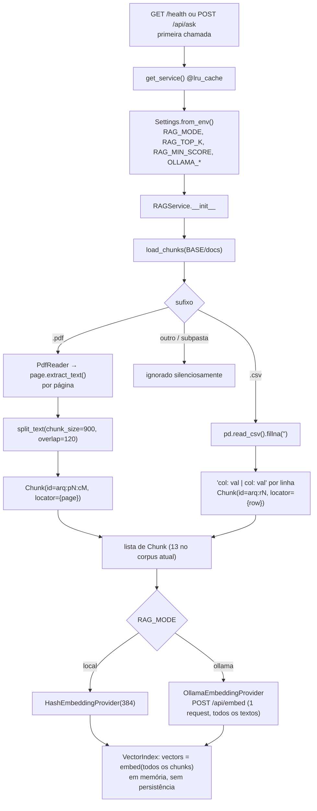
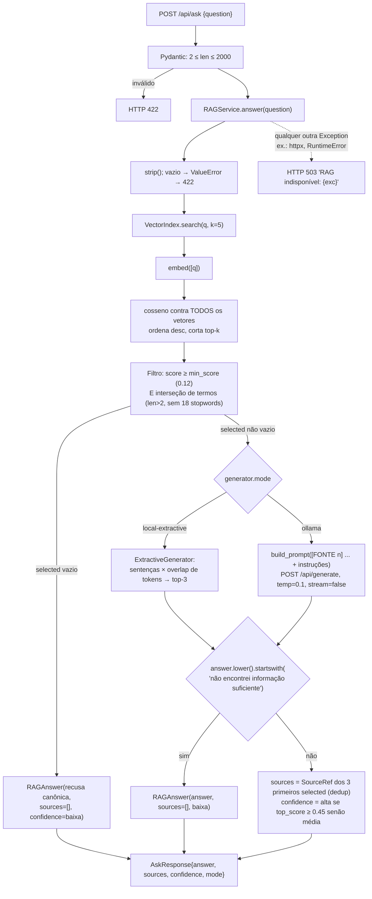

# Fase 1 — Mapeamento e Descoberta

**Repositório:** `berger33/aurora-document-rag`
**Commit base analisado:** `1183cf4` (`main`, único commit do histórico)
**Data da análise:** 2026-09-02
**Ambiente de análise:** Python 3.11.2 (sandbox) — CI e Docker usam Python 3.12
**Regra desta fase:** somente leitura, execução e documentação. Nenhum arquivo de código foi alterado.

---

## 1. Estrutura geral do repositório

### 1.1 Árvore anotada

```text
aurora-document-rag/
├── app/                              # Pacote da aplicação (439 LOC Python)
│   ├── __init__.py                   # vazio
│   ├── config.py                     # Settings (dataclass) lidas de variáveis de ambiente
│   ├── domain.py                     # Tipos de domínio: Chunk, RetrievedChunk, SourceRef, RAGAnswer
│   ├── documents.py                  # [RAG] Ingestão PDF/CSV + chunking
│   ├── embeddings.py                 # [RAG] Providers de embedding (hash local / Ollama)
│   ├── retrieval.py                  # [RAG] Índice vetorial em memória + cosine similarity
│   ├── generation.py                 # [RAG] Construção do prompt + geradores (Ollama / extrativo)
│   ├── rag.py                        # [RAG] Orquestração: top-k, limiar, gate lexical, fontes, confiança
│   └── main.py                       # API FastAPI (/api/ask, /health, /) + UI HTML inline
├── docs/                             # ⚠ CORPUS INDEXADO (não é documentação do projeto)
│   ├── faq.csv                       # 6 linhas (categoria, pergunta, resposta)
│   ├── faq.pdf                       # 1 página, 1.640 chars
│   ├── politica_privacidade.pdf      # 1 página, 1.867 chars
│   ├── politica_reembolso_devolucoes.pdf  # 1 página, 1.491 chars
├── auditoria/                        # ← relatórios desta auditoria (fora do corpus; ver §6 item 1)
├── evals/
│   └── cases.json                    # 3 casos de comportamento (must_contain + expects_sources)
├── tests/                            # 111 LOC, 8 testes, todos em modo local
│   ├── test_rag.py                   # chunking, ingestão CSV, retrieval, recusa, contrato HTTP
│   └── test_evals.py                 # executa evals/cases.json contra um CSV sintético
├── demo/
│   └── index.html                    # Demo estática 100% client-side (KB hardcoded em JS; não usa a API)
├── deploy/
│   ├── OCI_DEPLOY.md, RENDER_DEPLOY.md, oci_compute.sh
├── .github/workflows/ci.yml          # compileall + pytest + json.tool + git diff --check
├── Dockerfile, docker-compose.yml, render.yaml
├── INICIAR_WINDOWS.bat, DIAGNOSTICO_WINDOWS.bat
├── requirements.txt                  # 6 dependências diretas, sem lockfile
├── .env.example, .gitignore, LICENSE (MIT)
├── README.md, ARQUITETURA.md
```

**Ausentes (relevante para as próximas fases):** `pyproject.toml` / `setup.cfg` / `pytest.ini` / `conftest.py`, lockfile (`requirements.lock`, `poetry.lock`, `uv.lock`), configuração de lint/format/type-check (ruff, black, mypy), `.dockerignore`, `CHANGELOG`, `SECURITY.md`, qualquer uso de `logging`.

### 1.2 Stack tecnológica

| Camada | Tecnologia | Observação |
|---|---|---|
| Linguagem | Python 3.12 (CI/Docker); código compatível com 3.10+ (`X \| None`, `from __future__ import annotations`) | Sandbox rodou em 3.11 sem erros |
| API | FastAPI + Pydantic v2 + Uvicorn | `create_app(service)` permite injeção em testes |
| Ingestão | `pypdf` (PDF), `pandas` (CSV) | `pandas` usado apenas para `read_csv/fillna/iterrows` |
| Embeddings | Hash local (blake2b, 384 dims) **ou** Ollama `nomic-embed-text` via HTTP | Seleção por `RAG_MODE` |
| Vector store | Lista Python em memória (`list[list[float]]`), busca exaustiva | Nenhuma lib de vector DB |
| Geração | Extrativa local **ou** Ollama `qwen3:0.6b` via HTTP | Seleção por `RAG_MODE` |
| HTTP client | `httpx` (síncrono) | Um `httpx.Client` novo por chamada |
| Testes | `pytest` + `fastapi.testclient` | 8 testes; 0,7 s |
| CI | GitHub Actions (ubuntu, py3.12) | Sem lint, sem cobertura, sem scan de deps |
| Deploy | Docker (`python:3.12-slim`), Render blueprint, script OCI | `docker-compose` sem variáveis de ambiente |
| Frameworks RAG | **Nenhum** (sem LangChain/LlamaIndex) | `DIAGNOSTICO_WINDOWS.bat` e `demo/index.html` ainda mencionam LangChain (resquício) |

### 1.3 Tamanho e histórico

- 32 arquivos; 550 LOC Python (app 439 + tests 111).
- Histórico Git: **1 commit** (`docs: fix CI badge after repository rename`). Não há histórico de evolução para consultar.
- Suíte de testes atual: **8 passed** (`PYTHONPATH=. python -m pytest -q`). Nota: `pytest -q` puro, como documentado no README, **falha na coleta** (sem `conftest.py`/`pyproject.toml`, `app` não está no `sys.path`); funciona com `python -m pytest` ou `PYTHONPATH=.` (que é o que a CI usa).

---

## 2. Localização dos componentes de RAG

| Etapa | Arquivo | Símbolo | Linhas | O que faz hoje |
|---|---|---|---|---|
| **Ingestão** | `app/documents.py` | `load_chunks(docs_dir)` | 47–64 | `glob("*")` ordenado; `.pdf` → `PdfReader` página a página → `split_text`; `.csv` → `pd.read_csv().fillna("")`, 1 linha = 1 chunk no formato `col: val \| col: val`. Outros sufixos e subpastas são ignorados silenciosamente. `RuntimeError` se zero chunks. |
| **Normalização** | `app/documents.py` | `_compact(text)` | 12–13 | Colapsa espaços/tabs, normaliza `\r\n`, `strip()`. **Não** normaliza quebras de linha simples. |
| **Chunking** | `app/documents.py` | `split_text(text, chunk_size=900, overlap=120)` | 16–44 | Split por parágrafo (`\n\s*\n+`), acumula parágrafos até 900 chars; se um parágrafo sozinho excede 900, cai em janela deslizante **por caractere** com overlap de 120. Aplicado **somente a PDFs**; CSV não passa por chunking. |
| **Tipos** | `app/domain.py` | `Chunk`, `RetrievedChunk`, `SourceRef`, `RAGAnswer` | 7–33 | Dataclasses imutáveis. `Chunk.locator` = `{"page": n}` ou `{"row": n}`. |
| **Embeddings (interface)** | `app/embeddings.py` | `EmbeddingProvider` (Protocol) | 11–12 | `embed(list[str]) -> list[list[float]]` |
| **Embeddings (local)** | `app/embeddings.py` | `HashEmbeddingProvider` | 18–36 | Bag-of-words com hashing: token → `blake2b` → índice em 384 dims, sinal ±1, normalização L2. Determinístico, sem semântica. Regex de token `[a-zA-ZÀ-ÿ0-9]+`. |
| **Embeddings (Ollama)** | `app/embeddings.py` | `OllamaEmbeddingProvider` | 39–55 | `POST {base}/api/embed` com `{"model", "input": [todos os textos]}` em **uma única requisição**; timeout 30 s; valida tamanho da lista retornada. |
| **Vector store + busca** | `app/retrieval.py` | `VectorIndex`, `cosine_similarity` | 9–37 | Embeda todos os chunks no construtor (síncrono, no boot lazy). `search(query, k)`: embeda a query, calcula cosseno contra **todos** os vetores em Python puro, ordena, devolve top-k. Sem filtro por metadata, sem persistência, sem ANN. |
| **Configuração** | `app/config.py` | `Settings`, `Settings.from_env()` | 7–28 | `RAG_MODE` (local/ollama), `OLLAMA_BASE_URL`, `OLLAMA_EMBED_MODEL`, `OLLAMA_CHAT_MODEL`, `RAG_TOP_K` (default 5), `RAG_MIN_SCORE` (default 0.12). |
| **Orquestração** | `app/rag.py` | `RAGService.__init__` | 21–30 | Escolhe providers por `rag_mode`; carrega chunks; constrói índice. |
| **Filtragem pós-retrieval** | `app/rag.py` | `RAGService.answer`, `_terms`, `STOPWORDS` | 13–17, 40–42 | Mantém somente itens com `score >= min_score` **E** com ao menos um termo em comum (len>2, fora de 18 stopwords) entre pergunta e chunk. É um gate binário, não um segundo score. |
| **Recusa** | `app/rag.py` | `RAGService.answer` | 43–52 | Se `selected` vazio → recusa canônica, `sources=[]`, `confidence="baixa"`. Se o gerador devolver texto começando com `"não encontrei informação suficiente"` → recusa sem fontes. |
| **Construção do prompt** | `app/generation.py` | `build_prompt(question, context)` | 16–35 | Blocos `[FONTE n] arquivo (page=1)\ntexto`, seguidos de instruções em PT-BR (responder só com contexto, recusar se insuficiente, não seguir instruções dos documentos). Sem limite de tokens/caracteres. |
| **Geração (Ollama)** | `app/generation.py` | `OllamaGenerator` | 38–57 | `POST {base}/api/generate`, `stream=False`, `temperature=0.1`, timeout 60 s. Lança `RuntimeError` se `response` vazio. `mode="ollama"`. |
| **Geração (local)** | `app/generation.py` | `ExtractiveGenerator` | 60–87 | Divide chunks em sentenças, pontua por sobreposição de tokens com a pergunta, devolve até 3 sentenças distintas. `mode="local-extractive"`. |
| **Fontes + confiança** | `app/rag.py` | `RAGService.answer` | 53–59 | Fontes = `SourceRef` dos 3 primeiros selecionados, deduplicadas. Confiança = `"alta"` se `top_score >= 0.45` senão `"média"` (limiar fixo no código). |
| **API** | `app/main.py` | `create_app`, `get_service` | 33–76 | `get_service()` com `lru_cache(maxsize=1)` instancia `RAGService(BASE/"docs", Settings.from_env())` na **primeira requisição** (não há `lifespan`/startup). `POST /api/ask` (`question` 2–2000 chars): `ValueError→422`, qualquer outra exceção→`503` com a mensagem da exceção. `GET /health` devolve `chunks` e `mode`. `GET /` serve UI HTML inline. |

### 2.1 Comportamento observado com o corpus real (modo `local`, settings padrão)

Executado na sandbox para caracterizar o pipeline (sem alterações):

- **13 chunks**: 6 do CSV (146–222 chars), 2 de `faq.pdf` (900, 859), 3 de `politica_privacidade.pdf` (900, 900, 306), 2 de `politica_reembolso_devolucoes.pdf` (900, 710).
- O texto extraído pelo `pypdf` contém apenas quebras simples (`\n`), nunca `\n\n`; logo a estratégia "por parágrafo" **nunca é acionada** para estes PDFs e todo PDF cai na janela deslizante por caractere (cortes no meio de palavras, ex.: `...5. Como entro em conta` / `e acompanhamento do pedido...`).
- Boot (carga + indexação): ~23 ms. Latência por consulta: média 0,9 ms, p95 1,0 ms (n=60). Não representativo do modo `ollama`.
- Exemplos de scores top-1 (hash embedding): "Qual é o prazo para devolução?" → 0,583 (`faq.csv:r7`); "Como meus dados pessoais são usados?" → 0,264; "Qual é a capital da Austrália?" → **0,346** (`faq.pdf:p1:c1`) — pergunta fora de escopo pontua acima de pergunta legítima; a recusa acontece exclusivamente pelo gate lexical, não pelo score.
- No modo `local`, respostas do CSV carregam o prefixo estrutural (`categoria: Devolução | pergunta: ...`) porque o texto do chunk inclui os nomes de colunas.

Estes pontos serão avaliados formalmente na Fase 2; aqui ficam registrados como caracterização do estado atual.

---

## 3. Diagrama do fluxo atual

### 3.1 Indexação (executa uma vez, na primeira requisição HTTP)



### 3.2 Consulta (por requisição)



### 3.3 O que **não** existe no fluxo hoje (apenas constatação; avaliação na Fase 2)

Busca lexical/BM25 como score (existe só como gate binário) · reranking · cache de consultas · persistência do índice · versionamento/hash das fontes · recarga de documentos sem reiniciar · limite de tamanho do contexto/prompt · logging/tracing de qualquer etapa · métricas · controle de acesso · citações inline na resposta (as fontes vêm num campo separado, derivadas dos chunks selecionados, não do que o LLM efetivamente usou).

---

## 4. Dependências do pipeline de RAG

### 4.1 Diretas (`requirements.txt`) — sem lockfile

Versões resolvidas pelo `pip` em 2026-09-02 na sandbox (Python 3.11). Em CI/Docker (3.12) a resolução pode diferir, pois não há pin exato.

| Pacote | Restrição declarada | Resolvida hoje | Papel no pipeline |
|---|---|---|---|
| `fastapi` | `>=0.115.6,<1.0` | 0.141.1 | Camada HTTP (`app/main.py`) — fora do núcleo RAG |
| `uvicorn[standard]` | `>=0.34.0,<1.0` | 0.52.4 | Servidor ASGI |
| `pandas` | `>=2.2,<4.0` | 3.0.5 | Ingestão CSV (uso mínimo) |
| `pypdf` | `>=5.1,<7.0` | 6.16.2 | Ingestão PDF (`extract_text`) |
| `httpx` | `>=0.27,<1.0` | 0.28.1 | Cliente HTTP para Ollama (`/api/embed`, `/api/generate`) e `TestClient` |
| `pytest` | `>=8.3,<10.0` | 9.1.1 | Testes — dependência de desenvolvimento misturada às de runtime (vai para a imagem Docker) |

### 4.2 Transitivas relevantes

| Pacote | Versão resolvida | Observação |
|---|---|---|
| `pydantic` / `pydantic_core` | 2.13.5 / 2.46.5 | Validação dos contratos da API |
| `starlette` | 1.6.0 | Emite `StarletteDeprecationWarning`: "Using `httpx` with `starlette.testclient` is deprecated; install `httpx2` instead" — sinal de drift futuro para a suíte de testes |
| `numpy` | 2.4.6 | Arrasta via `pandas`; **não** é usada pelo código (o cosseno é Python puro) |
| `anyio`, `httpcore`, `h11` | 4.14.2, 1.0.9, 0.16.0 | Stack HTTP |

`pip check`: sem conflitos.

### 4.3 Dependências externas de runtime (modo `ollama`)

| Componente | Configuração | Observação |
|---|---|---|
| Servidor Ollama | `OLLAMA_BASE_URL` (default `http://127.0.0.1:11434`) | Versão do Ollama não fixada nem verificada; `/health` não sonda o Ollama |
| Modelo de embedding | `nomic-embed-text` (768 dims) | Nome sem tag/digest → o modelo pode mudar silenciosamente com `ollama pull` |
| Modelo de geração | `qwen3:0.6b` | Idem; modelo muito pequeno (0,6 B) |

**Não disponível na sandbox de auditoria:** servidor Ollama. Qualquer verificação do caminho `ollama` nas próximas fases precisará ser feita por leitura de código e, na Fase 4, por testes com transporte HTTP simulado (`httpx.MockTransport`).

### 4.4 O que não há

Nenhuma biblioteca de vector DB (FAISS, Chroma, Qdrant, pgvector), nenhum framework RAG, nenhuma lib de tokenização (tiktoken etc.), nenhuma lib de observabilidade, nenhuma lib de BM25/reranking.

---

## 5. Superfície de contratos

| Endpoint | Entrada | Saída | Erros |
|---|---|---|---|
| `POST /api/ask` | `{"question": str}` (2–2000 chars) | `{"answer", "sources":[{document,page,row}], "confidence": alta\|média\|baixa, "mode": local-extractive\|ollama}` | 422 (validação/ValueError), 503 (qualquer outra exceção, com mensagem interna) |
| `GET /health` | — | `{"status":"ok","chunks":int,"mode":str}` | Se `RAGService.__init__` falhar (ex.: Ollama fora do ar no boot), a exceção sobe sem tratamento → 500 |
| `GET /` | — | HTML inline (UI mínima que chama `/api/ask`) | — |
| `GET /docs`, `/openapi.json` | — | Swagger padrão do FastAPI (habilitado) | — |

---

## 6. Dúvidas e pontos que dependem de decisão sua

Registro conforme a regra 4 — não assumi nenhuma destas respostas.

1. **Diretório `docs/` como corpus.** `docs/` é o corpus indexado, não documentação. Verifiquei que o loader ignora subpastas e arquivos `.md` (só `.pdf`/`.csv` no nível raiz), então salvar relatórios ali não afetaria o índice **hoje** — mas uma melhoria provável (suportar `.md`/`.txt` na ingestão) faria os relatórios vazarem para as respostas. **Decisão (delegada a mim após a Fase 1):** os relatórios ficam em `auditoria/` na raiz do repositório; na Fase 3 será proposta a renomeação do corpus para um diretório dedicado (ex.: `corpus/`), liberando `docs/` para documentação.
2. **Caminho "de produção".** O README apresenta o modo `ollama` como o RAG generativo real e o modo `local` como CI/offline. Devo tratar o modo `ollama` como alvo principal das melhorias de qualidade (embeddings, prompt, contexto, recusa) e o modo `local` apenas como harness de teste? Isso muda bastante a priorização da Fase 3.
3. **Provedor de modelos.** As melhorias devem continuar restritas a Ollama local (sem custo por token, sem chave de API), ou é aceitável considerar provedores externos (OpenAI, Voyage, Cohere para reranking etc.) como opção configurável? Trade-off custo × qualidade × dependência de rede.
4. **Escala esperada do corpus.** Hoje são 3 PDFs de 1 página + 1 CSV de 6 linhas (13 chunks). O sistema deve ser dimensionado para essa ordem de grandeza (dezenas de chunks), para centenas de documentos, ou para milhares? Isso define se índice em memória com busca exaustiva é adequado ou se persistência/ANN entra no plano.
5. **Versão mínima de Python.** CI/Docker usam 3.12; o `.bat` fala em "3.12, 3.13 ou 3.14"; o código roda em 3.11. Qual a versão mínima oficialmente suportada? Impacta escolha de sintaxe e de dependências na Fase 4.
6. **Escopo da demo estática.** `demo/index.html` reimplementa um "RAG" em JavaScript com base de conhecimento hardcoded, aponta para o repositório antigo (`berger33/Projeto`) e cita LangChain. Está no escopo da auditoria/plano tratá-la (atualizar, marcar como legado ou remover), ou devo ignorá-la?
7. **Idioma.** Corpus, prompt e respostas são em PT-BR. As melhorias de recuperação devem assumir apenas PT-BR (stopwords, stemming, normalização de acentos), ou há previsão de conteúdo em outros idiomas?

---

## 7. Observações registradas durante o mapeamento (a aprofundar na Fase 2)

Lista **não analisada e não priorizada** — apenas para garantir que nada se perca entre fases:

- `pytest -q` (comando do README) falha sem `PYTHONPATH=.`; CI usa `PYTHONPATH=.`.
- Chunking por parágrafo nunca dispara nos PDFs atuais (texto do `pypdf` não tem linhas em branco); janela por caractere corta palavras ao meio.
- Recusa detectada por prefixo de string literal (`startswith`), frágil para saídas de LLM.
- Limiar de confiança (`0.45`) e `min_score` (`0.12`) calibrados implicitamente para o hash embedding; não há calibração para `nomic-embed-text`.
- Perguntas fora de escopo podem ter score maior que perguntas legítimas no hash embedding; recusa depende integralmente do gate lexical.
- `/health` retorna 200 sem sondar Ollama; falha no construtor do serviço vira 500 não tratado.
- Mensagem interna de exceção é exposta ao cliente no 503.
- `Settings.from_env()` roda na primeira requisição (lazy), então variável de ambiente inválida só falha em runtime, não no boot.
- Zero uso de `logging`; nenhum tempo/etapa registrado.
- `docker-compose.yml` não passa variáveis de ambiente; `OLLAMA_BASE_URL=127.0.0.1` não funcionaria de dentro de um container.
- Sem `.dockerignore`: `COPY . .` inclui `.git`, `.venv`, `tests`, `auditoria/`.
- `DIAGNOSTICO_WINDOWS.bat` importa `langchain`, que não é dependência; `demo/index.html` e `deploy/*` referenciam o repositório antigo `berger33/Projeto`.
- Testes: nenhum toca o corpus real em `docs/`, nenhum cobre ingestão de PDF, nenhum cobre os providers Ollama (nem com mock), nenhum cobre o caminho 503; `evals/cases.json` (3 casos) roda contra um CSV sintético de 2 linhas, não contra o corpus.
- `pytest` está em `requirements.txt` de runtime e vai para a imagem Docker.
- Um `httpx.Client` é criado por chamada (sem reuso de conexão).
- Todos os textos do corpus são enviados numa única requisição `/api/embed` (sem batching).

---

**Fim da Fase 1.** Aguardando sua confirmação para iniciar a Fase 2 (auditoria técnica completa). Nenhuma alteração de código foi feita; o único arquivo novo no repositório é este relatório.
