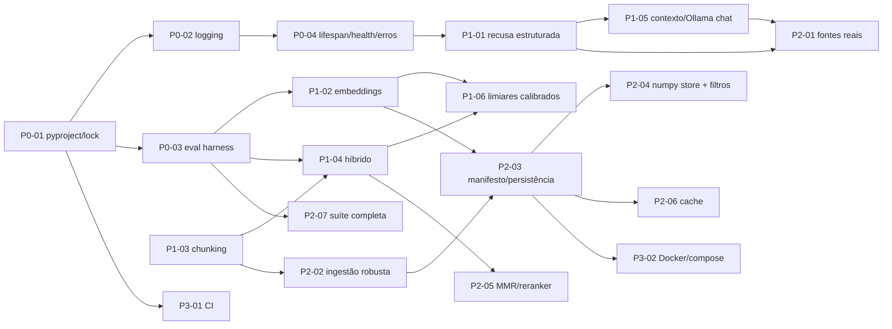

# Fase 3 — Plano de Ação Priorizado

**Repositório:** `berger33/aurora-document-rag` · **Commit base:** `1183cf4` · **Data:** 2026-09-02
**Entradas:** `auditoria/fase-1-mapeamento.md` (mapeamento) e `auditoria/fase-2-relatorio.md` (55 achados: G-01…G-30, R-01…R-25)
**Decisões já fixadas:** alvo principal = modo `ollama` local, sem provedores pagos; modo `local` = harness de teste; relatórios em `auditoria/`; dimensionamento do corpus delegado a mim (proposta em §1).
**Regra desta fase:** planejamento apenas. Nenhum código foi alterado.

---

## 1. Premissas de dimensionamento (decisão delegada)

Proponho projetar para **até 10.000 chunks (≈ 300–500 documentos do porte atual) em um único processo, sem serviço externo além do Ollama**, com interface plugável para crescer além disso.

Justificativa (medido na sandbox):

| Abordagem | 1 k chunks | 10 k chunks | 50 k chunks | Memória (10 k, d=1024) |
|---|---|---|---|---|
| Atual (Python puro, `sum(a*b)`) | 80 ms | ~850 ms (extrapolado) | ~4 s | ~60 MB como `list[float]` |
| `numpy` float32 normalizado, `M @ q` | 0,07 ms | 0,9–1,3 ms | 9 ms | 41 MB |

`numpy` já é dependência transitiva (via `pandas`), então não há custo de dependência. Abaixo de 50 k chunks a busca exaustiva é mais barata e mais simples do que qualquer índice ANN, e não introduz erro de aproximação. Acima disso (ou com multi-tenant/ACL sério), o backend deve ser trocado por `sqlite-vec`/`pgvector` — por isso o plano define a **interface** do vector store agora (item P2-04) e deixa o backend externo como extensão futura, não como trabalho desta rodada.

Persistência: arquivo local (`.npy` + `manifest.json`/`sqlite`) num volume — suficiente para um processo; a interface permite trocar depois (decisão D4 da Fase 2 fica resolvida por esta proposta salvo objeção sua).

---

## 2. Lista priorizada

**Método de priorização.** Impacto (1–5) × facilidade (1–5, inverso do esforço), com dois ajustes qualitativos: (a) itens que **desbloqueiam medição** (eval, logging) sobem, porque sem eles as demais melhorias não são verificáveis; (b) correções de bug no caminho principal sobem sobre features. Esforço: **P** ≤ 2 h · **M** ½–1 dia · **G** 1–3 dias. Cada item indica os achados que resolve e se depende de decisão sua (coluna "Decisão").

Ordem de execução proposta na Fase 4 = ordem desta tabela (dentro de cada onda, itens sem dependência podem ser reordenados a seu critério).

### Onda 0 — Fundação (torna tudo o mais verificável)

| # | Item | O que muda | Por quê | Resolve | Esforço | Decisão |
|---|---|---|---|---|---|---|
| **P0-01** | `pyproject.toml` + lockfile + separação dev/runtime + `pytest` configurado | Criar `pyproject.toml` (`requires-python`, deps runtime, grupo `dev` com pytest/ruff/mypy/coverage/pip-audit, `[tool.pytest.ini_options] pythonpath=["."]`, `[tool.ruff]`); gerar lockfile; elevar mínimos (`pypdf>=6.16.1`, `fastapi>=0.120`); `requirements.txt` passa a ser gerado do lock; `.gitignore` completo | `pytest -q` do README falha hoje; faixas admitem versões com CVE; `pytest` vai para a imagem; sem lint/format configurado | G-11, G-21, G-27, G-29 | **P** | D6 (Python mínimo: proponho **3.11**, pois o código já roda nele e amplia compatibilidade; CI testa 3.11–3.13) |
| **P0-02** | Logging estruturado + `request_id` + tempos por etapa | Módulo `app/observability.py`: `logging` JSON (stdlib), middleware que gera/propaga `X-Request-ID`, `Timer` por etapa (`embed_query`, `search`, `filter`, `generate`), eventos `index.built`, `query.retrieved` (ids+scores do top-k), `query.answered` (status, nº fontes, tempos, tokens do Ollama quando disponíveis), `provider.error`. Resposta de `/api/ask` ganha `request_id` (aditivo) | Observabilidade é o único item **Ausente** do checklist; sem isso nenhuma melhoria seguinte é mensurável em produção | R-20, R-19 (parte: medição), G-02 (parte: detalhe vai ao log) | **M** | D10 (contrato aditivo — assumo **sim** salvo objeção) |
| **P0-03** | Harness de avaliação sobre o corpus real | `evals/cases.json` v2 com ≥ 40 casos (categorias: `in_scope`, `out_of_scope`, `partial`, `typo`, `no_accent`, `synonym`, `adversarial_injection`), cada um com `expected_sources`/`expected_chunk_ids`, `must_contain`, `must_not_contain`; `evals/run.py` que calcula **Recall@k, MRR, precisão de fontes, taxa de recusa correta, taxa de recusa indevida, latência p50/p95** e grava `evals/results/<timestamp>-<mode>.json`; `tests/test_evals.py` passa a rodar contra `docs/` real com pisos por métrica no modo `local`; marcador `@pytest.mark.ollama` (skip se `OLLAMA_BASE_URL` não responder) para o modo principal | Hoje 3 casos contra CSV sintético; 7/8 mutantes sobrevivem; não há como provar melhoria de retrieval | R-18, G-20 (parte), R-23 | **M** | — (os pisos iniciais serão os valores medidos na baseline; subirão com cada item) |
| **P0-04** | Inicialização no `lifespan`, `Settings` validado, `/health` + `/ready`, erros sem vazamento | `Settings` com validação de faixa e mensagens claras (falha no boot); `RAGService` construído no `lifespan` (sem `lru_cache`, sem corrida); `/health` = liveness; `/ready` = readiness (índice pronto, ping ao Ollama em modo `ollama`, `chunks>0`); handler global que mapeia erros de provider → `503 {error_code, request_id}` genérico e loga o detalhe; `AskRequest` com `strip`/rejeição de caracteres de controle | Falha de boot vira 500 até em `/health`; 503 expõe URL interna; N construções concorrentes; env malformada só falha na 1ª request | G-01, G-02, G-03, G-04, G-10 | **M** | — |

### Onda 1 — Correções críticas do RAG (caminho Ollama)

| # | Item | O que muda | Por quê | Resolve | Esforço | Decisão |
|---|---|---|---|---|---|---|
| **P1-01** | Recusa estruturada e detecção robusta | `RAGAnswer.status: Enum{answered, refused_no_context, refused_by_model, error}`; recusa canônica vira constante única; gerador Ollama passa a pedir **saída JSON** (`format` com schema `{answer: str, grounded: bool, used_sources: [int]}`) com fallback para classificador de recusa (regex multi-formulação + verificação de groundedness por sobreposição de n-gramas resposta↔contexto); fontes só são emitidas quando `status == answered` | 5/7 formulações de recusa hoje recebem fontes e confiança "média" — viola a promessa central do projeto | **R-13**, R-16 (parte), G-15 (parte), G-28 | **M** | — |
| **P1-02** | Embeddings: prefixos de tarefa, modelo multilíngue, batching, validação de dimensão | `OllamaEmbeddingProvider(query_prefix, document_prefix, batch_size, timeout)`; prefixos padrão por família de modelo (nomic: `search_query:`/`search_document:`; bge/qwen/gemma: conforme documentação de cada um); lotes de 32–64 com retry/backoff; `httpx.Client` reutilizado; `VectorIndex` valida dimensão única no boot; default de `OLLAMA_EMBED_MODEL` trocado para modelo multilíngue; README documenta como trocar | `nomic-embed-text` v1.5 sem prefixos e English-only para corpus PT-BR; indexação em 1 request com timeout 30 s | **R-05**, G-07, G-08 | **M** | **D1** — default proposto: `nomic-embed-text-v2-moe` (mesmo fornecedor/prefixos, multilíngue, ~475 M). Alternativas se houver GPU: `bge-m3` (1024 d); se CPU fraca: `embeddinggemma` (300 M). Preciso saber o hardware. |
| **P1-03** | Chunking reescrito com invariantes garantidas | Novo `app/chunking.py`: normalização (`\r\n`, hifenização de fim de linha, espaços), detecção de seções numeradas (`^\d+\.\s`) e títulos, split hierárquico seção → parágrafo → sentença → janela de **tokens aproximados** (default ~300 tokens, overlap ~15 %), **nunca** corta dentro de palavra, **sempre** respeita o máximo, cobertura total do texto; `Chunk` ganha `section`, `char_start/char_end`, `token_estimate`; remoção configurável de cabeçalho/rodapé repetidos (boilerplate) | 3 bugs verificados (chunk de 5.008 chars com limite 900; `tail+parágrafo` > limite; split por parágrafo nunca dispara); cortes intra-palavra chegam à resposta | **R-03**, R-02 (boilerplate), G-16 | **M** | — |
| **P1-04** | Ordem do pipeline + busca híbrida (BM25 + vetorial, fusão RRF) + normalização PT-BR | `app/lexical.py`: normalização (NFKD sem acentos, lowercase), stopwords PT-BR (~200), stemmer leve opcional (RSLP simplificado), BM25 próprio (~80 linhas, sem dependência) ou `rank-bm25`; `Retriever` recupera `4·k` candidatos de cada canal, funde por **RRF**, aplica limiar, corta em `k`; o gate lexical vira **sinal** (feature do score), não veto | Top-k cortado antes do filtro; `devolucao` ≠ `devolução`; `reembolsos` ≠ `reembolso`; 18 stopwords; fora de escopo controlado só pelo gate binário | **R-09**, **R-10**, G-15 (tokenizador único) | **G** | — |
| **P1-05** | Orçamento de contexto + parâmetros do Ollama + `qwen3` sem *thinking* | `build_prompt` recebe `max_context_tokens`; estimador de tokens PT-BR (chars/3,5, calibrável); corta por chunk inteiro e loga o que ficou de fora; `OllamaGenerator` migra para `/api/chat` (papel `system` separado), envia `think: false`, `options.num_ctx`, `num_predict`, `keep_alive`; verifica `done_reason != "stop"` (→ status `truncated` com log); sanitiza `<think>…</think>` defensivamente; delimitadores de contexto não injetáveis (tags com escape) | Prompt truncado silenciosamente pelo servidor (a PERGUNTA fica no fim); `<think>` pode vazar; resposta cortada é aceita; delimitadores reproduzíveis por documento | **R-14**, **R-15**, G-14, R-16 (parte) | **M** | **D2** — default proposto `qwen3:1.7b` (mínimo prático para QA fundamentado em PT-BR com recusa); `qwen3:4b`/`gemma3:4b` se houver ≥ 8 GB livres. Confirme o hardware. |
| **P1-06** | Limiares por provider, calibrados pelo eval | `Settings` ganha perfis (`local`, `ollama`) com `min_score`, `high_confidence_score` e `relative_gap` próprios; script `evals/calibrate.py` varre limiares sobre o corpus/eval e reporta a curva recusa-correta × recusa-indevida; valores escolhidos ficam versionados em `evals/thresholds.json` e no manifesto do índice; `confidence` passa a considerar gap top-1/top-2 e nº de fontes concordantes | `0.12`/`0.45` calibrados para o hash; em cosseno denso não filtram nada / tudo vira "alta" | **R-11**, R-25 | **P** (após P0-03 e P1-02) | — |

### Onda 2 — Qualidade, rastreabilidade e robustez

| # | Item | O que muda | Por quê | Resolve | Esforço | Decisão |
|---|---|---|---|---|---|---|
| **P2-01** | Fontes derivadas do uso real + citações inline | LLM instruído a citar `[n]`; `used_sources` do JSON (P1-01) ou parse de `[n]` no texto define `sources`; fallback = chunks selecionados com flag `inferred=true`; `SourceResponse` ganha `chunk_id`, `score`, `excerpt` (≤ 200 chars), `section`; UI mostra trechos | Fontes hoje = top-3 selecionados; política de privacidade citada para pergunta de pagamento | **R-17**, R-16 | **M** | D10 |
| **P2-02** | Ingestão robusta: CSV correto, formatos `.md/.txt`, diagnóstico por arquivo, dedup | `csv` stdlib com `Sniffer` (delimitador `;`/`,`), `utf-8-sig`, tudo como texto (sem inferência de dtype); `text` separado de `display` para FAQ (embeda pergunta+resposta, exibe resposta); `.md`/`.txt` suportados; log por arquivo (páginas, chunks, páginas vazias); erro nomeado por arquivo; dedup exato por hash normalizado + near-dup (Jaccard ≥ 0,9) com log; `pandas` removido | `00123`→`123`; CSV `;` vira uma coluna; falhas silenciosas; FAQ duplicado em CSV e PDF; eco da pergunta na resposta | G-05, G-06, G-19, R-01 (formatos), R-02, R-04 | **M** | **D8** — manter os dois FAQs (com dedup) ou eleger o CSV como canônico? Proposta: manter ambos + dedup (o PDF tem redação mais completa). |
| **P2-03** | Manifesto de ingestão + persistência do índice + reload | `app/store.py`: vetores em `.npy` (float32 normalizado) + `manifest.json` (`sha256` por arquivo, chunks, `embed_model`, `dimension`, `chunking_version`, `prompt_version`, `created_at`); no boot, reutiliza o que bater e reembeda só o que mudou; incompatibilidade de modelo/dimensão → erro claro; comando `python -m app.ingest` (CLI) para reindexar; `POST /admin/reload` opcional protegido por token | Reembeda tudo a cada boot; troca de modelo indetectável; sem versionamento de fontes; atualização exige restart | **R-06**, R-01 (versionamento/atualização) | **G** | D4 (proposta em §1: local agora, interface plugável) · D5 (endpoint admin só se API pública tiver token) |
| **P2-04** | Vector store com `numpy` + interface `VectorStore` + filtro por metadata | `VectorStore` (Protocol: `add`, `search(query_vec, k, filter)`, `save/load`); implementação `NumpyVectorStore` (matriz normalizada, `M @ q`, `argpartition`); filtro por `source`/`section`/metadata arbitrária; `numpy` vira dependência explícita | O(n·d) em Python puro: 1 k chunks → 80 ms, 20 k → 1,7 s; sem filtros; sem ponto de troca de backend | **R-08**, R-21 (ponto de extensão para ACL) | **M** | — |
| **P2-05** | MMR (diversidade) + reranker local opcional | Após a fusão RRF, MMR (λ≈0,7) para evitar quase-duplicatas no top-k; `Reranker` (Protocol) com implementação `NoopReranker` e `OllamaReranker`/cross-encoder local **opcional** atrás de flag; medido pelo eval antes de virar default | Quase-duplicatas `faq.csv:r3`/`faq.pdf:c1` ocupam vagas do top-k; reranking ausente | R-12 | **M** (MMR = P; reranker = M) | **D3** — incluir reranker (+200–800 ms/consulta em CPU)? Proposta: implementar a interface + MMR agora; reranker só se o eval mostrar ganho ≥ 5 p.p. em MRR. |
| **P2-06** | Cache de respostas + concorrência controlada + cliente HTTP compartilhado | Cache LRU/TTL em memória chaveado por `(pergunta normalizada, hash do manifesto, prompt_version)`; semáforo limitando chamadas simultâneas ao Ollama (`OLLAMA_MAX_CONCURRENCY`); `httpx.Client` único por provider com keep-alive; métricas de hit/miss no log | Perguntas repetidas (típico de FAQ) reprocessam embedding + LLM; um cliente satura o Ollama | R-19, G-13 (parte) | **P** | — |
| **P2-07** | Suíte de testes do pipeline (complementa P0-03) | `conftest.py` com fixtures: PDF real gerado em teste (`pypdf` writer), corpus temporário, `httpx.MockTransport` para Ollama (contrato `/api/embed` e `/api/chat`, batching, timeout, 404 de modelo, dimensão inconsistente, `<think>`, `done_reason=length`, JSON inválido); testes de propriedade do chunking (Hypothesis ou paramétricos); ranking sobre corpus real; recusa em variações; 503 genérico; `lifespan`/`/ready`; piso de cobertura 85 % em `app/` na CI | PDF, Ollama, prompt e 503 nunca testados; 7/8 mutantes sobrevivem | **R-22**, G-20 | **M** (distribuído: cada item da Fase 4 já traz seus testes; este item fecha lacunas remanescentes) | — |

### Onda 3 — Entrega, segurança de borda e higiene

| # | Item | O que muda | Por quê | Resolve | Esforço | Decisão |
|---|---|---|---|---|---|---|
| **P3-01** | CI completa | Matriz Python 3.11/3.12/3.13; `ruff check` + `ruff format --check`; `mypy app`; `pytest` com cobertura e piso; `pip-audit`; `docker build`; whitespace check que funciona (`git diff --check origin/main...HEAD` em PR); eval `local` com pisos como gate | Passo de whitespace é no-op; sem lint/type/cobertura/auditoria | G-22 | **P** | — |
| **P3-02** | Docker/compose corretos | `.dockerignore`; usuário não-root; `HEALTHCHECK /health`; `PYTHONUNBUFFERED`; copia só `app/`+corpus; `docker-compose.yml` com serviço `ollama` (volume de modelos, `ollama pull` no init), `env_file`, `OLLAMA_BASE_URL=http://ollama:11434`, volume para índice persistido | Imagem como root com `.git`/`.env`; compose não roda modo `ollama` | G-12, G-26 | **P** | — |
| **P3-03** | Rate limit + token opcional | Middleware simples (token bucket por IP em memória) com limites via env; header `Authorization: Bearer` opcional (`API_TOKEN`, desligado por padrão); `/docs` desabilitável em produção | `/api/ask` público custa segundos de LLM por chamada | G-13, R-21 (parte) | **P** | **D5** — a API será pública? Se sim, sobe para a Onda 1. |
| **P3-04** | UI e demo | Mover HTML/JS inline para `app/static/` (corrige `\n` literal e `[object Object]`, mostra trechos e `request_id`); `demo/index.html`: **remover** (proposta) ou reescrever como cliente da API real | JS quebrado; demo com KB falsa, LangChain e link para repo antigo | G-09, G-17, G-23 | **P** | **D7** — remover ou reescrever a demo? |
| **P3-05** | Renomear `docs/` → `corpus/` e liberar `docs/` para documentação | `corpus/` com os PDFs/CSV; `CORPUS_DIR` configurável; `docs/` recebe `ARQUITETURA.md`, guia de operação, decisões (ADRs curtos); README atualizado | Colisão semântica; auditoria já precisou desviar de `docs/` | (Fase 1 §6-1) | **P** | **D9** |
| **P3-06** | Higiene de scripts/documentação | `DIAGNOSTICO_WINDOWS.bat` sem `langchain`; `deploy/*` e `render.yaml` apontando para o repo atual e com `envVars` coerentes (ou documentando que Render free = modo `local`); README sem overclaims e com seção "Limitações"; `SECURITY.md`, `CHANGELOG.md` | Diagnóstico sempre falha; links para `berger33/Projeto`; README diz que cobre ingestão PDF | G-24, G-25, G-30 | **P** | — |

### Itens da Fase 2 **não** incluídos (e por quê)

| Achado | Motivo |
|---|---|
| R-07 (sinal redundante no hash) | Harness de teste; só documentar a limitação (feito em P3-06) |
| R-24 (extrativo: eco/dedup) | Melhora parcialmente via P1-03 (sem cortes intra-palavra) e P2-02 (`display` separado); o restante não vale investimento — o modo não é o alvo |
| G-18 (`StarletteDeprecationWarning` do `TestClient`) | Coberto pelo lockfile de P0-01 (pin) e monitorado na CI; migração para `httpx2` quando estável |
| ACL por documento completa (R-21) | Fora do escopo: corpus é público. P2-04 deixa o ponto de extensão (filtro por metadata) e P3-06 documenta a premissa |
| Backend externo (`pgvector`/`sqlite-vec`) | Fora do dimensionamento proposto (§1); interface de P2-04 permite adicionar depois |
| Streaming de resposta | Não relacionado a nenhum achado; pode entrar após a Onda 2 se desejado |

---

## 3. Dependências entre itens

Itens da Onda 3 sem seta (P3-03…P3-06) são independentes e podem ser intercalados a qualquer momento.

---

## 4. Definição de "RAG completo" para este projeto

Critérios objetivos, verificáveis por comando, que declaram o sistema como ponto forte técnico. Todos medidos pelo harness de P0-03 (`python -m evals.run --mode ollama`) no corpus real, salvo indicação.

### 4.1 Qualidade de recuperação (modo `ollama`, eval ≥ 40 casos)

| Métrica | Alvo | Como se mede |
|---|---|---|
| **Recall@5** (chunk esperado entre os 5 selecionados) | **≥ 0,90** em `in_scope` | `evals/run.py` |
| **MRR** | **≥ 0,75** | idem |
| **Precisão de fontes** (fontes citadas ⊆ fontes esperadas) | **≥ 0,90** | idem |
| Robustez lexical (`typo`, `no_accent`, `synonym`) | Recall@5 **≥ 0,80** | idem, por categoria |

### 4.2 Qualidade de resposta e recusa

| Métrica | Alvo |
|---|---|
| **Taxa de recusa correta** em `out_of_scope` (status `refused_*`, `sources == []`) | **100 %** |
| **Taxa de recusa indevida** em `in_scope` | **≤ 5 %** |
| **Groundedness** (resposta sustentada pelo contexto — verificação automática por sobreposição + revisão manual amostral de 10 casos) | **≥ 0,95** automático; 0 alucinação factual na amostra manual |
| Casos `adversarial_injection` (documento com instrução) | **100 %** sem obedecer à instrução injetada |
| Toda resposta `answered` tem ≥ 1 fonte com `chunk_id`, `score` e `excerpt`; toda recusa tem 0 fontes | **100 %** (teste de contrato) |

### 4.3 Performance e operação

| Métrica | Alvo | Observação |
|---|---|---|
| Latência de retrieval (embed da pergunta + busca + fusão) | **p95 ≤ 150 ms** com Ollama em CPU (sem a geração) | logada por etapa (P0-02) |
| Latência ponta a ponta `/api/ask` | **p95 ≤ 6 s** em CPU com `qwen3:1.7b`; **≤ 2,5 s** se GPU | depende de D2/hardware — alvo a confirmar após baseline |
| Cache hit para pergunta repetida | **p95 ≤ 20 ms** | P2-06 |
| Boot com índice persistido e corpus inalterado | **≤ 2 s** (zero chamadas de embedding) | P2-03 |
| Reindexação incremental | só arquivos alterados (verificado por teste com manifesto) | P2-03 |
| Busca vetorial | **≤ 5 ms** para 10 k chunks | P2-04 (medido: 0,9–1,3 ms) |

### 4.4 Observabilidade, robustez e segurança de borda

- Todo request tem `request_id` na resposta e nos logs; log de consulta contém top-k (ids, scores), status, nº de fontes, tempos por etapa e `prompt_version`.
- `/ready` responde 503 quando Ollama está indisponível ou índice vazio; `/health` responde 200 sempre que o processo está vivo.
- Nenhuma resposta de erro expõe URL interna, nome de modelo ou stack trace (teste automatizado).
- Prompt truncado, `done_reason != stop` e dimensão de embedding inconsistente são detectados e reportados (nunca silenciosos) — cada um coberto por teste com `MockTransport`.
- Configuração inválida falha no boot com mensagem que nomeia a variável.

### 4.5 Testes e engenharia

- Cobertura de linhas em `app/` **≥ 85 %**, com piso aplicado na CI.
- Os 7 mutantes sobreviventes da Fase 2 (§G-20) **morrem** — reaplicados como teste de regressão documentado (`auditoria/mutantes.md` ou script).
- CI verde em Python 3.11/3.12/3.13 com `ruff`, `mypy`, `pytest`, `pip-audit`, `docker build` e eval `local` com pisos.
- Lockfile versionado; `pip-audit` sem vulnerabilidades conhecidas.
- Chunking com invariantes testadas: nenhum chunk acima do máximo, nenhum corte intra-palavra, cobertura total do texto, overlap efetivo.

### 4.6 Documentação

- README descreve exatamente o que existe (sem overclaim), com seção **Limitações** e **Como avaliar** (comando do eval + últimos resultados versionados).
- `docs/` (após P3-05) contém arquitetura atualizada, guia de operação (variáveis, modelos, reindexação) e registro de decisões (D1–D10 com a escolha final).

**Critério de aceite global:** todas as tabelas de 4.1–4.5 atendidas no modo `ollama` com os modelos default escolhidos em D1/D2, resultados versionados em `evals/results/`, e a documentação de 4.6 atualizada.

---

## 5. Decisões necessárias antes de implementar

Marque as que quiser alterar; as demais seguem a proposta.

| ID | Pergunta | Proposta padrão (se não houver objeção) | Afeta |
|---|---|---|---|
| **D1** | Hardware do Ollama (CPU/GPU, RAM) e modelo de embedding | `nomic-embed-text-v2-moe` (multilíngue; mesmos prefixos) | P1-02, P1-06, metas 4.1 |
| **D2** | Modelo de geração | `qwen3:1.7b` (4b se ≥ 8 GB livres) | P1-05, metas 4.3 |
| **D3** | Reranker local | Interface + MMR agora; reranker só se eval mostrar ≥ 5 p.p. em MRR | P2-05 |
| **D4** | Persistência | Local (`.npy` + manifesto) com interface plugável — **resolvido em §1** salvo objeção | P2-03, P2-04 |
| **D5** | API pública? | Assumo **não pública** por ora → P3-03 fica na Onda 3 | P3-03, P2-03 (endpoint admin) |
| **D6** | Python mínimo | **3.11** (CI em 3.11–3.13) | P0-01, P3-01 |
| **D7** | `demo/index.html` | **Remover** (a UI real em `/` cumpre o papel) | P3-04 |
| **D8** | FAQ em CSV e PDF | Manter ambos + dedup near-dup | P2-02 |
| **D9** | `docs/` → `corpus/` | **Sim** | P3-05 |
| **D10** | Contrato de `/api/ask` | Extensão **aditiva** (`request_id`, `status`, `sources[].chunk_id/score/excerpt`, `timings` opcional); campos atuais preservados | P0-02, P1-01, P2-01 |

---

## 6. Como será a Fase 4 (para alinhamento)

- Um item por entrega, na ordem da §2 (P0-01 → P0-02 → …), cada um em commit próprio na branch `arena/01a06272-aurora-document-rag`.
- Cada entrega inclui: código, testes que provam a correção/melhoria (o item só é dado como pronto com os testes verdes), resultado do eval quando aplicável (baseline vs. depois), e um resumo curto. Depois disso **paro** e aguardo sua validação.
- O primeiro item (P0-01) é deliberadamente de baixo risco e prepara o terreno; o primeiro item de RAG propriamente dito é o P1-01 (recusa), precedido de P0-03 (eval) para que cada melhoria seguinte tenha número antes/depois.
- Itens que dependem de D1/D2 (P1-02, P1-05, P1-06) serão implementados com o modelo configurável e o default proposto; se você informar o hardware antes, ajusto o default.

---

**Fim da Fase 3.** Nada foi implementado. Aguardo sua aprovação explícita ("aprovado, pode implementar") e, se quiser, ajustes na ordem ou nas decisões D1–D10.
