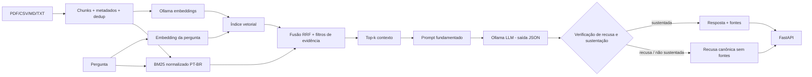

# Arquitetura — Aurora Document RAG

## Objetivo

Responder perguntas usando exclusivamente a documentação da Aurora, com separação explícita entre ingestão, retrieval, geração e API.

## Componentes

| Componente | Responsabilidade |
|---|---|
| `app/documents.py` | lê PDF/CSV/Markdown/texto e produz chunks rastreáveis; CSV via stdlib com delimitador detectado e valores como texto; diagnóstico por arquivo; dedup exato e near-dup |
| `app/chunking.py` | normalização (wrap visual, hifenização, boilerplate), seções numeradas/Markdown, split hierárquico seção → parágrafo → sentença → janela com sobreposição; invariantes: máximo respeitado, sem corte intra-palavra, cobertura total |
| `app/embeddings.py` | converte textos em vetores; provider local ou Ollama (prefixos de tarefa por família de modelo, lotes, retry, validação de dimensão) |
| `app/retrieval.py` | liga o provider de embeddings a um `VectorStore` |
| `app/persistence.py`, `app/ingest.py` | manifesto do índice (modelo, dimensão, chunking, prefixos, sha256 por arquivo) e carga/reconstrução no boot; CLI `python -m app.ingest` |
| `app/store.py` | interface `VectorStore` (ponto de troca de backend) e `NumpyVectorStore`: matriz float32 normalizada, `M @ q` + `argpartition`, filtro por `source`/`section`/locator, `save`/`load` em `.npy` |
| `app/lexical.py` | BM25 próprio sobre texto normalizado (sem acentos, stopwords PT-BR, stemmer leve) |
| `app/retriever.py` | retrieval híbrido: pool de 4·k por canal, fusão RRF, filtro com três níveis de evidência (cobertura lexical ponderada por IDF, cosseno + radical âncora, cosseno alto), corte em k |
| `app/generation.py` | monta prompt com orçamento de tokens e delimitadores escapados; extrativo local ou LLM Ollama via `/api/chat` (`system` separado, `think: false`, `format` JSON, `num_ctx`/`num_predict`, `done_reason` verificado) |
| `app/rag.py` | aplica top-k, limiar, relevância, geração, verificação e fontes |
| `app/security.py` | token Bearer opcional em `/api/*`, token bucket por IP em `POST /api/ask` (429 + `Retry-After`), `/docs` desabilitável — tudo desligado por padrão (D5) |
| `app/cache.py`, `app/ollama_client.py` | cache LRU/TTL de respostas chaveado por pergunta normalizada + versão do índice + versão do prompt; semáforo de concorrência ao Ollama e cliente HTTP compartilhado com keep-alive |
| `app/rerank.py` | MMR sobre os aprovados (vetores do próprio índice) e interface `Reranker` (`noop` por padrão) |
| `app/sources.py` | deriva as fontes do uso real (`used_sources` → `[n]` inline → fallback `inferred`), escolhe o trecho de sustentação e remove marcadores da resposta |
| `app/refusal.py` | decide se a saída do gerador é resposta ou recusa: declaração estruturada + classificador léxico + sustentação pelo contexto |
| `app/text.py` | normalização PT-BR (sem acentos, minúsculas), tokenização e stopwords compartilhadas |
| `app/domain.py` | tipos do domínio: `AnswerStatus`, `Confidence`, `Generation`, `RAGAnswer`, texto canônico de recusa |
| `app/main.py` | expõe contratos HTTP; constrói o serviço no `lifespan`; `/health` (liveness), `/ready` (readiness); handler de erros com `error_code`; serve a UI de `app/static/` |
| `app/static/` | cliente HTML/CSS/JS mínimo da API (status, confiança, fontes com trecho, `request_id`); sem base de conhecimento própria |
| `app/config.py` | `Settings` a partir do ambiente, com validação de faixa e mensagens por variável (falha no boot); perfis de limiares por provider (`THRESHOLD_PROFILES`) |
| `evals/calibrate.py` | varredura de limiares sobre o eval: curva recusa correta × indevida por combinação, para calibrar cada provider |
| `app/errors.py` | exceções tipadas (`ProviderUnavailableError`, `ProviderTimeoutError`, …) com status HTTP e detalhe público genérico |
| `app/observability.py` | logging estruturado (JSON), `X-Request-ID` por requisição e tempos por etapa |
| `evals/harness.py`, `evals/run.py` | avaliação do pipeline sobre `corpus/` (Recall@k, MRR, precisão de fontes, recusas, latência) |

## Fluxo generativo

## Por que existe modo local

CI não deve depender de servidor Ollama nem de API paga. Por isso existe um provider vetorial determinístico e uma resposta extrativa. Esse caminho valida ingestão, retrieval, fontes e API; ele **não é apresentado como substituto semântico de um LLM**.

## Guardrails

1. Pergunta vazia é rejeitada.
2. Retrieval é híbrido (vetorial + BM25 fundidos por RRF) e filtra o pool fundido — não um top-k já cortado — exigindo evidência de relevância em três níveis: cobertura lexical ponderada por IDF, ou cosseno médio com um radical em comum, ou cosseno alto. `devolucao`/`devolução`/`devoluções` são o mesmo termo.
3. O prompt instrui o modelo a tratar documentos apenas como dados e não seguir instruções contidas neles; além da instrução, trechos e pergunta ficam em blocos com delimitadores escapados (um chunk não consegue fechar `</contexto>` nem abrir `<pergunta>`), e o prompt tem orçamento explícito de tokens — o que não cabe é descartado por chunk inteiro e logado, nunca truncado pelo servidor.
4. Sem contexto suficiente, a resposta é de recusa. A recusa do modelo é reconhecida por declaração estruturada (`grounded: false`), por padrões de múltiplas formulações em PT-BR e por verificação de sustentação (tokens de conteúdo e quantidades da resposta precisam existir no contexto) — nunca por comparação com uma frase exata.
5. Fontes são derivadas do que o gerador declarou usar (`used_sources` do JSON ou `[n]` no texto), com fallback para os chunks selecionados marcado `inferred`; carregam `chunk_id`, `score`, `section` e `excerpt`, e só são emitidas quando `status == answered`.
6. Falha do provider gera `503` com `error_code` estável em vez de sucesso inventado; a mensagem interna (URL, erro de rede) vai só para o log, correlacionada pelo `request_id`.
7. Configuração inválida ou índice impossível de construir encerram o processo no boot (`lifespan`), nunca viram `500` em produção; `/ready` distingue "índice pronto" de "Ollama e modelos disponíveis".

## Extensões futuras

- backend `pgvector`/Qdrant atrás da interface `VectorStore`;
- endpoint administrativo de reload protegido por token (a lógica `RAGService.reload()` já existe);
- reranker real (cross-encoder local) atrás da interface `Reranker`, condicionado ao eval;
- streaming;
- avaliação de groundedness (juiz) sobre as respostas do modo Ollama.
